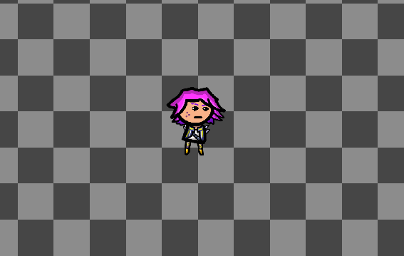

[](https://github.com/theovier/athena/actions)
[](https://github.com/theovier/athena/blob/main/COPYING)
[](https://github.com/libgdx/libgdx)
[](https://github.com/libktx/ktx)

# Athena
This is a 2D shoot'em up game done in [KTX](https://github.com/libktx/ktx). 
After having worked with some state-of-the-art engines like Unity and Unreal, I decided to toy around with a more old-school approach to making games. 
The main purpose of this project is simply to play around with some ideas and homemade graphics. 
Don't expect anything too fancy or polished here.

## Status
Work in progress.

## Features
- Uses [Ashley](https://github.com/libktx/ktx/tree/master/ashley) as its [ECS](https://en.wikipedia.org/wiki/Entity_component_system)
- Basic movement system with acceleration and friction
- Smooth camera movement by simple [asymptotic average](https://www.youtube.com/watch?v=tu-Qe66AvtY&t) 
- Smooth translational + rotational [camera shake based on trauma](https://www.youtube.com/watch?v=tu-Qe66AvtY&t)
- Custom prefab system (using XML internally)
- Controller support with [relatively smooth aiming](https://www.gamasutra.com/blogs/MarkVenturelli/20150817/251387/Everything_I_Learned_About_DualStick_Shooter_Controls.php)
- Basic support for [tiled maps](https://github.com/libktx/ktx/tree/master/tiled)
- Particle system relying on [LibGdx's particle system](https://github.com/libgdx/libgdx/wiki/2D-ParticleEffects)

## Screenshots


## Building from Source
This project uses **Maven 3** as its build management tool.
If you installed Maven just clone the repository or download the .zip and navigate to the root-level pom.xml.
Then simply run

```
mvn package
```

and check your /target folder for the newly generated jar files. 

### macOS
Please note that (even when run from within your IDE) you need to add the VM option flag `-XstartOnFirstThread`
to make the application window appear on macOS.

## Contribution
Feel free to open pull-requests or discuss ideas about the project.

## Acknowledgement
I used the [Quilly-Crawler](https://github.com/Quillraven/Quilly-Crawler) game as reference on how to get started with KTX.

## License
[GNU General Public License v3.0](https://choosealicense.com/licenses/gpl-3.0/#) except for the Spine Runtime.

### Spine Runtime
Please note that since the Spine Runtime dependency is used, this part of the project is licenced under the [Spine Runtime Licence](https://github.com/EsotericSoftware/spine-runtimes/blob/4.0/LICENSE) instead.