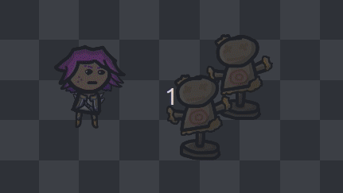
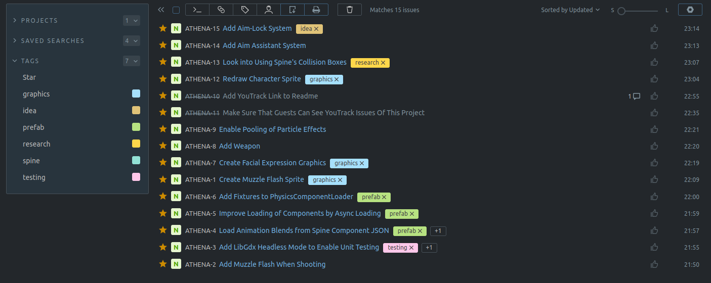

[](https://github.com/theovier/athena/actions)
[](https://github.com/theovier/athena/blob/main/COPYING)
[](https://github.com/libgdx/libgdx)
[](https://github.com/libktx/ktx)

# Athena
This is a 2D shoot'em up game done in [KTX](https://github.com/libktx/ktx).
The main purpose of this project is simply to play around with some ideas and homemade graphics.
Don't expect anything too fancy or polished here.

## Status
Work in progress.

## Features
- Uses [Ashley](https://github.com/libktx/ktx/tree/master/ashley) as its [ECS](https://en.wikipedia.org/wiki/Entity_component_system)
- Basic movement system with acceleration and friction
- Smooth camera movement by simple [asymptotic average](https://www.youtube.com/watch?v=tu-Qe66AvtY&t)
- Smooth translational + rotational [camera shake based on trauma](https://www.youtube.com/watch?v=tu-Qe66AvtY&t)
- Custom prefab system (using JSON)
  - Including entity hierarchy
  - Components can reference other entities/components in same prefab file
- Controller support with [relatively smooth aiming](https://www.gamasutra.com/blogs/MarkVenturelli/20150817/251387/Everything_I_Learned_About_DualStick_Shooter_Controls.php)
- Basic support for [tiled maps](https://github.com/libktx/ktx/tree/master/tiled)
- Particle system relying on [LibGdx's particle system](https://github.com/libgdx/libgdx/wiki/2D-ParticleEffects)
- Supports [Spine](http://de.esotericsoftware.com/) animations and skeletons
- Uses [LibGdx's Box2D](https://github.com/libgdx/libgdx/wiki/Box2d) as physic engine
- Simple damage system with floating damage text
- Simple loot system
- Bullet impact effects using dynamic spawning of particles 

## Screenshots



## Building from Source
This project uses **Maven 3** as its build management tool.
If you installed Maven just clone the repository or download the .zip and navigate to the root-level pom.xml.
Then simply run

```
mvn package
```

and check your /target folder for the newly generated jar files.

### macOS
Please note that (even when run from within your IDE) you need to add the VM option flag `-XstartOnFirstThread`
to make the application window appear on macOS.

## Contribution
This project uses [YouTrack](https://www.jetbrains.com/de-de/youtrack/) to track task instead of GitHub Issues.
You can have a look at pending tasks (also possible as unauthorized user) at [Athena's Issue Tracker](https://theovier.myjetbrains.com/youtrack/issues/ATHENA#)



Feel free to open up pull-requests or discuss issues with us either on GitHub or within our [Issue Tracker](https://theovier.myjetbrains.com/youtrack/issues/ATHENA#).

## Acknowledgement
I used the [Quilly-Crawler](https://github.com/Quillraven/Quilly-Crawler) game as reference on how to get started with KTX.
Also, I found [Sioncore](https://github.com/dsaltares/sioncore) to be a good read on how to develop modular LibGdx/KTX games.

For the creation of the bullet shell effects, I found [Rowdy Lemon's Youtube tutorial on shell casings](https://www.youtube.com/watch?v=vTAR14bVJPA&list=LL&index=16) extremely valuable.

For creating my particle effects I use the brilliant open-source [Talos Particle Engine](https://github.com/rockbite/talos).

## License
[GNU General Public License v3.0](https://choosealicense.com/licenses/gpl-3.0/#) except for the Spine Runtime.

### Spine Runtime
Please note that since the Spine Runtime dependency is used, this part of the project is licenced under the [Spine Runtime Licence](https://github.com/EsotericSoftware/spine-runtimes/blob/4.0/LICENSE) instead.

### Audio Files (Teeworlds)
Some audio files (namely `gun_fire-01.ogg`, `gun_fire-02.ogg` and `gun_fire-03.ogg`) are converted versions of the [Teeworlds' Sound Effects](https://github.com/teeworlds/teeworlds/tree/master/datasrc/audio) which are licenced under the [CC-BY-SA 3.0](https://github.com/teeworlds/teeworlds/blob/master/license.txt) 

### Audio Files (Other)
* The "gun shell hitting the floor" and the "ka-ching" sounds are licenced under the [Creative Commons Attributive Licence](https://creativecommons.org/licenses/by/3.0):
  * https://freesound.org/s/159002
  * https://freesound.org/s/159003
  * https://freesound.org/s/159004
  * https://freesound.org/s/159005
  * https://freesound.org/s/159006
  * https://freesound.org/s/159008
  * https://freesound.org/s/554841

### [Banger Font](https://www.1001fonts.com/bangers-font.html)
The used [banger font](https://www.1001fonts.com/bangers-font.html) is licenced under the [SIL Open Font Licence (OFL)](http://scripts.sil.org/OFL).